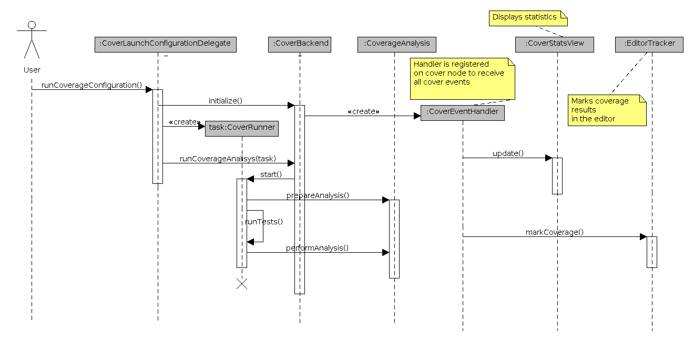

# Cover plug-in implementation details

Here you can learn some details about the Cover plug-in implementation.

## Projects

Cover functionality consists of the fallowing parts:

* org.erlide.cover.core (the main logic of the plugin)
* org.erlide.cover.erlang (Erlang helper that is responsible for performing coverage analysis)
* org.erlide.cover.ui (plugin GUI)
* org.erlide.cover.site (used for creating update site content)

## Performing coverage analysis

{: .frame }