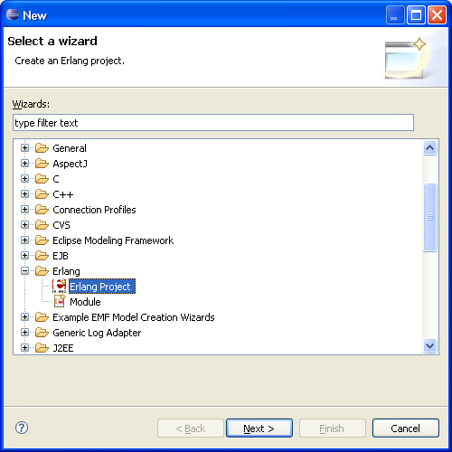
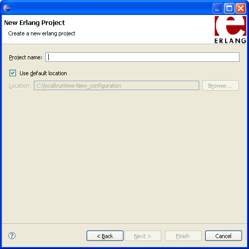

# {{ page.title }}

To create a project:

1. Click `File -> New -> Other... -> Erlang Project` or use the context menu
in the navigator, right-clicking and choosing `New -> Erlang Project`.

  {: .frame }

2. In the `New Erlang Project` wizard, enter the project name and if needed
choose the project's desired location. If you already have code in that location, it will be recognized and imported.

  {: .frame }

3. Click Next.
4. In the **Project Build Preferences** boxes, type Output, Source and
Include folders or use the default values.

  {: .frame }

5. To create your project, click Finish.

