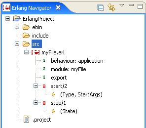

# Navigator view

The Erlang naviagor view displays, in a tree structure, only elements relevant
to Erlang project files. In this view you can do the following:

  * Browse the elements of `*.erl` source files
  * Open files in the editor view
  * Open projects in a new window
  * Create new projects, modules, files, or folders
  * Manage existing files (cut, paste, delete, move or rename)
  * Restore deleted files from local history
  * Import or Export files and projects

Files that you select in the Navigator view affect the information that is
displayed in other views.

{: .frame }

