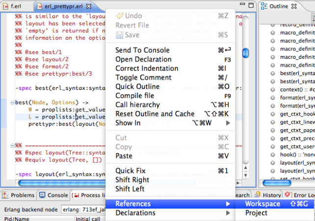
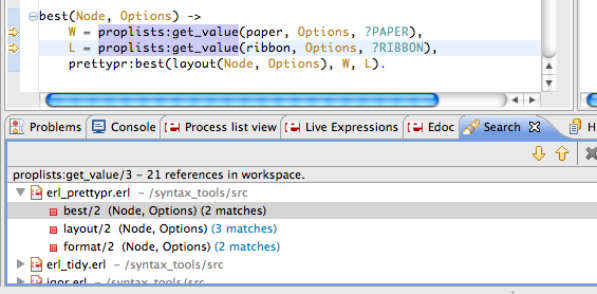

# {{ page.title }}

The Erlang searching support allows you to find definitions, references and
occurrences of Erlang elements (functions, records, macros, type
specifications and includes). Searching is supported by an index generated by
the Erlang parsing used by Erlide. The searching is done on files and editor
buffers, so even unsaved files in the workspace is searched (just like how the
outline is based on editor content). There are two ways to search in Erlide:
through commands in pop-up menus or through the search dialog.

The following searches can be initiated from the pop-up menus of Erlang
elements or from the Erlang search dialog:

- **References** - Finds all references to the selected Erlang element
- **Definitions** - Finds all definitions of the selected Erlang element
- **Occurrences** - Finds both references and definitions

The scope of the search is defined as:

  * **Workspace** - all projects and files in the workspace are included in
this search
  * **Selected resources** - all elements selected in the erlang navigator are
included
  * **Enclosing Projects** - the projects enclosing the currently selected
elements
  * **Working Set** - only resources that belong to the chosen working set are
included in this search

{: .frame }

The search popup-menu commands can be used when a searchable erlang element is
selected, from the editor, from the outline or from the navigator.

{: .frame }

{: .frame }

When a search is selected and started, the results are presented in the search
view. Double clicking on a line brings up the editor, and the matches are
marked in the right edge as usual. The arrows in the local toolbar navigates
to the next and previous result, and results can be selected and deleted.

{: .frame }

Search result

There are three keyboard shortcuts for the search commands:

* **Ctrl-Shift-G** References
* **Ctrl-G** Definitions
* **Ctrl-H** Search dialog

There are currently some limitations in the searching: only fully specified
functions (`module:function/arity`) can be matched, and included files are
always searched for references (matching the include directives). Also, only
files included in projects in the workspace are searched, not external modules
nor external includes. Nevertheless, the erlang searching is already useful.

