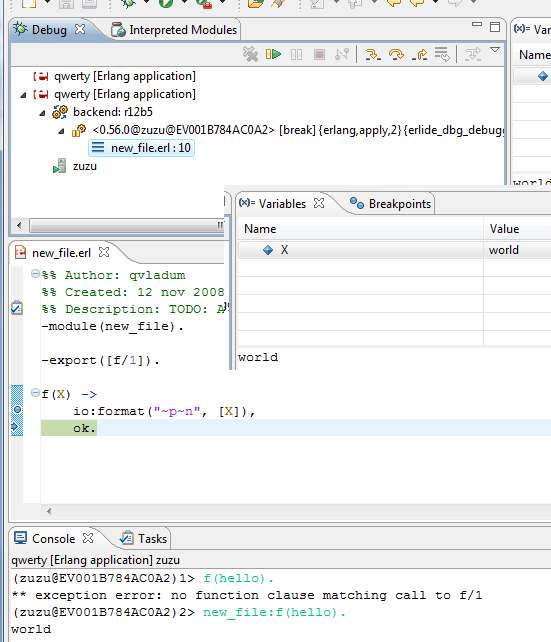

# Running and debugging Erlang code

The Eclipse way to specify how to run the code that is being developed is
called _launch configurations_. Erlide provides support for creating and
executing Erlang-specific launch configurations. These configurations can be
created and edited by opening the Run -> Run configurations... dialog (or the
Debug -> Debug configurations... one, which offers some additional debug-
specific options).

The main tab lets you select the projects whose code will be loaded and
executed. There is also provision for defining one's own initialization by
providing a function and arguments to be called. Please note that this function is meant for system initialization and works just like sending ```-s mod fun arg``` on the command line and that io:format calls from it will not get displayed in the console. The latter is because we start a remote shell, different from the "normal" shell associated with stdout.

{: .frame }

The runtimes tab lets you define the runtime that will be used and the node's
name and cookie. The cookie is optional, defaulting to the user's default
cookie.

An important note is that if you use long names and a node that is started externally, then the name in the dialog should not include the host name. This implies we can't connect to remote nodes on other machines, it is a known problem ([ticket](https://www.assembla.com/spaces/erlide/tickets/882-can-t-run-debug-on-external-nodes-on-remote-machines)).

{: .frame }

For a debug launch config, the debug tab contains the related options. The one
that is erlide specific is the list of interpreted modules. The selected
modules will be interpreted alongside with any module (from the referenced
projects) that contains an enabled breakpoint. A similar list is available in
the Interpreted modules view, allowing to change the status of the modules
while debugging.

{: .frame }

## Debugging

While in the debugger, you can do most of the things that are expected while
debugging: set breakpoints, execute code one line at the time, viewing local
variables and even modifying them. Until a more detailed documentation of the
debugger will be written, here come a couple of pictures showing a line of
code executed with a changed variable. Before:

{: .frame }

... and after:

{: .frame }


