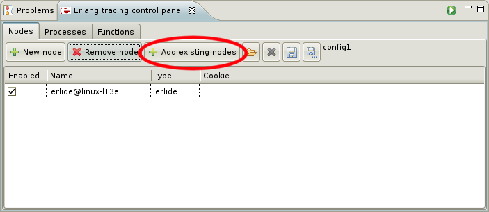

Here you will see example how to quickly setup tracing.

**1. Select nodes**

Using _Nodes_ tab specify which nodes you want to trace. If you have already started node from erlide simply click Add existing nodes to add this node and enable it checking checkbox in _Enabled_ column.
{: .frame }

If you want to connect to an external node, start it with a long name and in the view use the full name, just like it is shown in the node's shell prompt.

**2. Set process flags**

In _Processes_ tab set which process should be traced (you can leave "all") and set flags. To trace function calls set "call" flag.
{: .frame }

**3. Add trace patterns**

In _Outline_ view right click on function you want to trace and choose from context menu: _Tracing>Add to trace patterns_.
{: .frame }

In "Functions" tab you will see your pattern: 
{: .frame }

**4. Start tracing**

Start tracing clicking _Start tracing_ icon: 
{: .frame }

**5. Run your program and perform some action**

**6. Finish tracing clicking _Stop tracing_ icon**

{: .frame }

**7. In _trace browser_ you will see results of tracing**

{: .frame }

**8. If you select results of tracing you will see all events in tree viewer**

{: .frame }

You can open in editor function's or module's definition by double clicking on it's name in tree viewer.