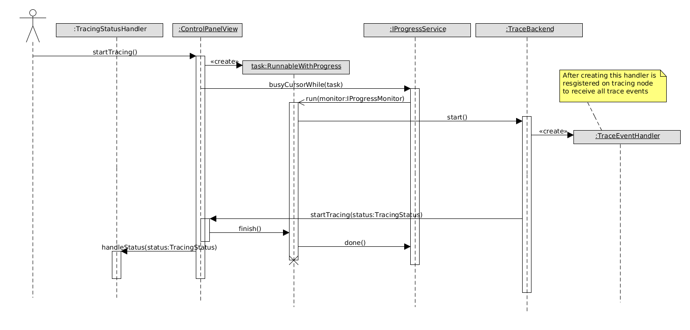

Here you will find implementations details

## Projects

Tracing functionality consists of following projects:

* _org.erlide.tracing_ - represents tracing "feature" that groups other plugins
* _org.erlide.tracing.core_ - plugin that provides all Java classes that interact with Eclipse through its extension points
* _org.erlide.tracing.erlang_ - plugin that provides Erlang helper functions for this feature (mainly used for interaction with ttb)
* _org.erlide.tracing.help_ - plugin that provides help pages for this feature (it contributes to Eclipse's help system)
* _org.erlide.tracing.site_ - project that is used for creating update site content
* _org.erlide.tracing.ttbe_ - plugin that contains ttbe code (extended version of ttb that is not included in OTP yet)

## Feature architecture

This feature provides three new views:

* _Erlang tracing control panel_ - UI for ttb, using it user can select processes and nodes that should be traced, set flags, create trace patterns,
* _Erlang trace browser_ - displays tracing results, using it user can load tracing results from disk
* _Erlang tracing tree viewer_ - displays all events from selected trace in trace browser

Those views are grouped under a new perspective called _Erlang Tracing_.
To provide communication between all views an Observer pattern was used. Each view is represented by class that implements _org.erlide.tracing.core.ITraceNodeObserver_. This interface must be implemented by every class that want be notified by _org.erlide.tracing.core.TraceBackend_ whenever some event occurs. _org.erlide.tracing.core.TraceBackend_ is a singleton class that is responsible for creating tracing node and running tracing tool (ttb) on it. When a view is created it registers itself in _org.erlide.tracing.core.TraceBackend_ as an listener.
Following diagram shows relations between those classes:
{: .frame }

Such design makes it easy to add a new view (in future there should be added view that represents trace events in a form of sequence diagram). Every view performs action on _org.erlide.tracing.core.TraceBackend_ (e.g. starting/stopping tracing) and this class after performing action, notifies all views (listeners) so they can update themselves.

## Tree viewer

_Erlang trace browser_ and _Erlang tracing tree viewer_ views use _JFace TreeViewer_ to display data. _TreeViewer_ provides mvc architecture to raw _SWT_ _Tree_ class. To create a tree view you need:

1. Create it, e.g.: `new TreeViewer(container, SWT.SINGLE);`
2. Assign content provider using `setContentProvider()` method (Content provider is a class that provides data to be displayed).
3. Assign label provider using `setLabelProvider()` method (Label provider is a class that tells tree viewer how to display each element).

You can find good example of creating tree viewer here:

* [https://www.eclipse.org/articles/Article-TreeViewer/TreeViewerArticle.htm](https://www.eclipse.org/articles/Article-TreeViewer/TreeViewerArticle.htm)
* [https://www.eclipse.org/articles/Article-Table-viewer/table_viewer.html](https://www.eclipse.org/articles/Article-Table-viewer/table_viewer.html)

### Model

In tracing plugin there is an _org.erlide.tracing.core.mvc.model.treenodes.ITreeNode_ interface which should be implemented by class that represents concrete tree node. Following class diagram shows those classes:
{: .frame }

Most of the nodes in _Erlang tracing tree viewer_ view are represented by _TreeNode_ class. However nodes representing functions and modules are represented by _FunctionNode_ and _ModuleNode_ classes. It is because when user double-clicks on them some action should be invoked (classes are used to distinguish type of node that was selected).
In _Erlang trace browser_ view are nodes are instances of _TracingResultsNode_ because they contain some additional information, such as path, dates and number of events.
Data for each tree viewer is stored in different list. You can obtain those list from _org.erlide.tracing.core.mvc.model.TraceCollections_ using static methods:

* `getFilesList()` - data displayed in _Erlang trace browser_ (all tracing results loaded into Eclipse)
* `getTracesList()` - data displayed in _Erlang tracing tree viewer_ (content of selected tracing result)

### View
_TreeContentProvider_ and _TreeLabelProvider_ provide data to be displayed.

### Controller
All listeners assigned to tree viewer act as controllers.

## Table viewer
_TableViewer_ is a _JFace_ class that provides mvc architecture to raw _SWT_ _Table_ class. It works very similar to TreeViewer, i.e. you also have to provide label and content providers. Only difference is that some fields can be edited. In such situation you have to provide two extra classes:

* _CellEditor_ for each column - it allows you to modify cell's value
* _Implementation_ of _ICellModifier_ - it acts as controller for cell's editor: reads cell's value from model when you activate editor and saves data when you finish editing

## Displaying busy dialogs

To show busy dialog you can use following code (from [wikipedia](https://wiki.eclipse.org/FAQ_How_do_I_switch_from_using_a_Progress_dialog_to_the_Progress_view%3F)):

```
   IRunnableWithProgress op = new IRunnableWithProgress() {
      public void run(IProgressMonitor monitor) {
         runDecathlon(monitor);
      }
   };
   IWorkbench wb = PlatformUI.getWorkbench();
   IWorkbenchWindow win = wb.getActiveWorkbenchWindow();
   Shell shell = win != null ? win.getShell() : null;
   new ProgressMonitorDialog(shell).run(true, true, op);
```

In this way job is executed in new thread while execution of UI thread pauses until run method is finished (i.e. work is done). However, in tracing feature sometimes we need to show busy dialog when calling one method and hide it when another method is called. It is because of design which uses observer pattern: one view invokes an action and when this action is finished its "notify" method is invoked to signal that action is done. Consider loading files:

1. In _Erlang trace browser_ view user opens dialog, selects folder with tracing results and clicks ok.
2. Browser view displays busy dialog which should be visible until loading is finished. It is to prevent user from performing other operations.
3. _TraceBackend_ creates listener which will receive all data from tracing node (one on which ttb runs) and tells ttb to start reading files
4. After reading is finished _TraceBackend_ notifies all listeners (in this case views) that it is done by calling `finishLoadingFile` method so each view can refresh itself if it is needed. In case of browser view it should hide busy dialog.

Similar use case is when stopping tracing.

To provide this functionality _org.erlide.tracing.core.ui.dialogs.RunnableWithProgress_ abstract class was implemented. All work (e.g. initialize loading file) you implement in abstract method `doAction()` of extending class. Then you pass instance of this class to `ProgressMonitorDialog.run()` method and after it you put code which has to be executed when busy dialog is hidden. In method which will be called when job is done you have to call `RunnableWithProgress.finish()`. Here is an example:

```
    //create variable that represents task    
    private RunnableWithProgress task;

    //................

            public void widgetSelected(SelectionEvent e) {
                task = new RunnableWithProgress("Loading trace results...") {
                    @Override
                    public void doAction() {
                        //initialize loading
                    }
                };
                //show busy dialog
                Shell shell = PlatformUI.getWorkbench().getActiveWorkbenchWindow().getShell();
                new ProgressMonitorDialog(shell).run(true, false, task);
                //execute when dialog is hidden:
                doAfterLoadingTraces();
            }

    //................

    //called to notify that loading is finished
    public void notify() {
        if (task != null)
            task.finish();
    }
```

## Actions

This section describes main use cases.

### Starting tracing

{: .frame }

### Stop tracing

{: .frame }

### Loading tracing results

{: .frame }

### Activating tracing result to display in tree viewer

{: .frame }

### Loading data from files to display in tree viewer

{: .frame }

## UML diagrams

All UML diagrams were created using _Eclipse UMLet plugin_. Sources of diagrams are available in _doc/uml_ directory of _org.erlide.tracing.core_ project.

## Useful links

* Ttb documentation: [https://www.erlang.org/doc/man/ttb.html, https://www.erlang.org/doc/apps/observer/ttb_ug.html](https://www.erlang.org/doc/man/ttb.html, https://www.erlang.org/doc/apps/observer/ttb_ug.html)
* Dbg: [https://www.erlang.org/doc/man/dbg.html](https://www.erlang.org/doc/man/dbg.html)
* Match specs: [https://www.erlang.org/doc/apps/erts/match_spec.html](https://www.erlang.org/doc/apps/erts/match_spec.html)
* Eclipse Helios SDK: [https://help.eclipse.org/helios/index.jsp](https://help.eclipse.org/helios/index.jsp)
* Eclipse plugin development (tutorial): [https://www.eclipsepluginsite.com](https://www.eclipsepluginsite.com)
* JFace TableViewer: [https://www.eclipse.org/articles/Article-Table-viewer/table_viewer.html](https://www.eclipse.org/articles/Article-Table-viewer/table_viewer.html), [https://www.eclipse.org/articles/Article-TreeViewer/TreeViewerArticle.htm](https://www.eclipse.org/articles/Article-TreeViewer/TreeViewerArticle.htm), [https://www.eclipse.org/articles/Article-SWT-Virtual/Virtual-in-SWT.html](https://www.eclipse.org/articles/Article-SWT-Virtual/Virtual-in-SWT.html)
* Error handling in Eclipse: [https://rtsys.informatik.uni-kiel.de/trac/kieler/wiki/Help/EclipseCookbook/ErrorHandling](https://rtsys.informatik.uni-kiel.de/trac/kieler/wiki/Help/EclipseCookbook/ErrorHandling)
* Displaying progress in Eclipse: [https://wiki.eclipse.org/FAQ_Why_should_I_use_the_new_progress_service%3F](https://wiki.eclipse.org/FAQ_Why_should_I_use_the_new_progress_service%3F), [https://wiki.eclipse.org/FAQ_How_do_I_switch_from_using_a_Progress_dialog_to_the_Progress_view%3F](https://wiki.eclipse.org/FAQ_How_do_I_switch_from_using_a_Progress_dialog_to_the_Progress_view%3F)
* Version numbering for Eclipse plugins: [https://wiki.eclipse.org/index.php/Version_Numbering](https://wiki.eclipse.org/index.php/Version_Numbering)
